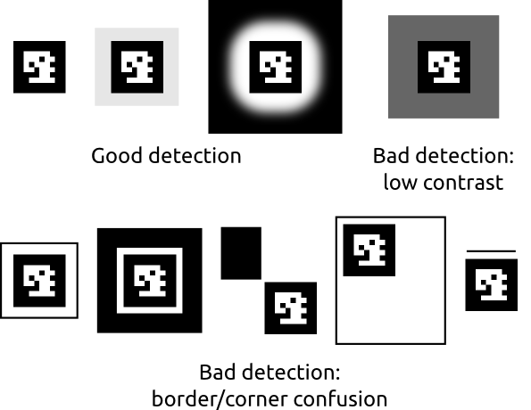

Chilitags 2: Robust Fiducial Markers for Augmented Reality and Robotics
=====================================================================

Chilitags are a C++ cross-platform software library for the detection and
identification of 2D fiducial markers (a.k.a. tags).  Their purpose is to be printed and
placed on objects from the real world, to form the basis of Robotics or
Augmented Reality (AR) applications.  Using a camera, the position of the tagged
objects can be acquired by a computer.

Chilitags were developed internally for projects of the [CHILI
lab](http://chili.epfl.ch/) (Computer-Human Interaction in Learning and
Instruction, formerly CRAFT), such as
[Metroscope](http://craft.epfl.ch/lang/en/PaperTangibleInterface) or
[TapaCarp](http://chili.epfl.ch/page-92256-en.html).  There are already many
alternatives (e.g. [ARToolKit](http://www.hitl.washington.edu/artoolkit/), or
[reacTIVision](http://reactivision.sourceforge.net/), among many others), but
we decided to release Chilitags anyway, as there seemed to be a demand for it.

The following videos show real applications of Chilitags for research in [tangible
learning](http://youtu.be/vnlLeCYxmCs) or [paper-based
interfaces](http://youtu.be/F_gSwHZ2u1Y).

Overview
--------

[](https://travis-ci.org/chili-epfl/chilitags)

### Features

Chilitags features two main functionalities:

* **Detecting tags** on images, i.e. finding their position on an input image.

* **Estimating the pose** in 3D, i.e. finding their position and orientation and
  in the real world.

Additionnally, Chilitags features various utilities to deal with imperfect
detection, such as filters to smooth the position of tags/3Dobjects.

The characteristics of Chilitags come from their original use:

 * **Illumination tolerance:** Chilitags were developed for use in
   projector/camera systems, which required the detection to be robust to the
   illumination constraints of the projector.

 * **Precision:** Chilitags were used in applications to teach geometry, which
   required the detection to be as precise as possible to match the requirement
   on the quality of work of the students.

 * **Reliability:** Chilitags were used for long experiments in ecologically
   valid conditions, which required to build systems stable even in various,
   uncontrolled settings.

Chilitags can be recognized even from low resolution images (tags as narrow
as 12 pixels are recognized).  However, they are very sensitive to occlusions:
if a border is occluded, the tag will not be detected.

The [Chilitags demonstration video](http://youtu.be/WafWuJfEYbg) gives a worst
case scenario for the sample code running in real time on a single thread of an
Intel Core i7-620m, with a camera set for 960x720x30fps, in an unevenly lit,
large scene. The detection has been improved since this video was made.


### Content

This release of Chilitags consists of five components:

 * `platforms`, the source code to expose the Chilitags API in various languages,

 * `include` and `src`, the library itself,

 * `tools`, containing a utility to generate tags,

 * `samples` and `samples-android`, sample programs illustrating how to use the library,
 
 * `test`, a suite of automated tests.


Getting Started
---------------

Chilitags have been developed on Linux (Ubuntu 64 bits), and are known to run
on Windows, MacOS X and Android.

### Dependencies

Chilitags rely on OpenCV 2.4+ and C++11.  They have has been recently tested with
OpenCV 2.4 and on Ubuntu (64 bits) 13.04, 13.10 and 14.04. The [documentation on
how to install OpenCV](http://docs.opencv.org/doc/tutorials/introduction/table_of_content_introduction/table_of_content_introduction.html)
can be found for various platforms and IDE.

On Ubuntu 12.04, you need to manually install a compiler supporting enough of
C++11 (for instance, `gcc-4.7`) and `opencv >= 2.4`. The `.travis.yml` file
contains commands to do this, in the `before_install` section

### Set up

CMake can be used to generate configuration files of the most popular IDE's of
the main platforms.  A CMakeLists file is provided in the release.  Please
refer to [online documentation on how to use
CMake](http://www.cmake.org/cmake/help/runningcmake.html).


### Example

For example on Ubuntu, the software can be compiled via makefile with the
following commands:

 * `sudo apt-get install libopencv-dev cmake`

 to install the OpenCV libraries and `cmake`

 * `mkdir build && cd build`

 to create the `build` folder where the compilation output will be placed

 * `ccmake ..`

 to configure the build. Activate the WITH_SAMPLES option.

 * `make`
 
 to build the library, the tag creation tool and the sample programs

 * `sudo make install`

 to install the library system-wide (see `CMake` options to install in another
 prefix).

 * `./samples/detect-live`
 
 to start the sample program with default parameters for the camera.

### Tag Generation

Once the software is up and running, the tags can be generated using the
`creator` executable in `tools`.  We also [generated sets of
tags](http://chili.epfl.ch/files/content/sites/chili/files/files/tags.zip) with various settings.

The `README` file accompanying `creator` gives important guidelines on how to
design and print chilitags.  It also explains the usage of `creator`.

The main design principles for tags are summarized below:



### Documentation

The documentation regarding the usage of `chilitags` is provided under the form
of the sample code `detect-live`.  Please refer to its `README` file and comments
in its source code.

### Platforms

Specific instructions for building Chilitags for Android can be found under 
[README-ANDROID.md](README-ANDROID.md).

### Coding style

This repository uses `uncrustify`, a tool that does automatic code formatting based on a predefined configuration defined in `uncrustify.cfg`.
In order to keep the code formatting consistent, it is useful to uncrustify before committing.
You may consider using a git pre-commit hook to remind you of this.

For example, you can add a pre-commit hook that inhibits you from committing if the source files are not formatted correctly.
Simply add a file `.git/hooks/pre-commit` that contains the following
```bash
#!/bin/sh

exec uncrustify -c uncrustify.cfg --check src/* include/*
```

More complex hooks can be built, such as [this one](https://github.com/githubbrowser/Pre-commit-hooks/blob/master/pre-commit-uncrustify) that runs uncrustify before every commit and stores the diff in a patch.

Licence
-------

Chilitags is released under the LGPL3.

In short, it means that you can do more or less what you want with Chilitags,
as long as you publish the modifications you make to Chilitags under the same
terms (but you don't have to share the sources of the rest of your software).

You should also credit the authors.

We especially appreciate a reference in your paper, should you use Chilitags
for a research project. Let us make that easy for you:

 * Chilitags: Robust Fiducial Markers for Augmented Reality. Q. Bonnard, S.
 Lemaignan, G.  Zufferey, A. Mazzei, S. Cuendet, N. Li, P. Dillenbourg.
 CHILI, EPFL, Switzerland. `http://chili.epfl.ch/software`. 2013.

```
	@misc{chilitags,
		title = {Chilitags 2: Robust Fiducial Markers for Augmented Reality and Robotics.},
		author={Bonnard, Quentin and Lemaignan, S\'{e}verin and Zufferey, Guillaume and Mazzei, Andrea and Cuendet, S\'{e}bastien and Li, Nan and \"{O}zg\"{u}r, Ayberk and Dillenbourg, Pierre},
		publisher={CHILI, EPFL, Switzerland},
		url={http://chili.epfl.ch/software},
		year={2013}
	}
```

Should you require a different licence, please contact
[CHILI](http://chili.epfl.ch).
