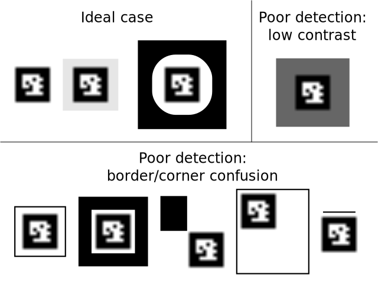

Chilitags Creator
=================

`creator` program is used to generate images of Chilitags, to use with your favourite software to print the tags.
We first give some guidelines relative to the use of such images to maximize the detection performance.
We then decribe the few options that can be given to `creator`.

Guidelines on designing and printing chilitags
----------------------------------------------

The detection of chilitags consists of two steps:
First, high contrasts having a quadrilateral shape are detected.
Second, the area inside the high contrast quadrilaterals are examined to determine the coded identifier, if any.

The high contrast quadrilaterals come from the black border around chilitags.
They are critical for the rest of the detection and decoding process.
It is thus important to avoid to degrade them.
The following guidelines should help in this purpuse:

 * The tag should be placed on a light background (white is best, light colors should work too) to make sure the border still contrasts with its surronding.

 * If there is another high contrast next to the borders, they can confuse the detection of the quadrilateral shape.
 Avoid placing chilitags too close from other borders.
 At minimum, surround the tag with a light border that is as wide as the black border of the tag.

 * The corners of the detected quadrilateral are refined to get a more precise position of the tag.
 Avoid placing the corners of chilitags next to other corners, to avoid noise in the detection.

Additional notes:

 * Some tags are known to be problematic. #22 is not recognized for an undetermined reason. #682 is completely black.

 * Each tags is assumed to be unique on the image.
 If more than one tag with the same identifier is present, the behavior is undetermined.

Usage of `creator`
------------------

`creator` generates the image of the chilitags of the specified identifier

### Synopsis

    creator tagId [zoom [margin [red green blue]]]

### Description

*tagId* is the id of the tag to draw, between 0 and 1023.
The generated image will be called [tagId].png and placed in the folder of execution.

*zoom* is a non null integer indicating the length in pixel of each bit of the tag matrix.
By default, the black border has a size of 10x10 pixels, i.e. 1 pixel ber bit of the matrix.
Some graphical editors (e.g. Inkscape) interpolate images when resized.
As a result, the inside of the tag becomes blurry.
It does not disturb the detection, as long as the outside, black border remains sharp, but for aesthetic reasons, it may be useful to provide a bigger size to `creator`. 

*margin* is n if and only if no white rectangle should be drawn around the tag.
Make sure to follow the design and printing guidelines then.

*red green blue* are integers within [0,255] which define the color with which
to draw the tag. The darker, the better. Black is default and optimal.

### Examples

 * `./creator 42` will produce 42.png, a 14x14 pixels image of tag #42. The white padding is `2*1` pixels thick, the black border is `2*1` pixels thick, and the matrix is `6*1` pixels large.

 * `./creator 123 20` will produce 123.png, a 280x280 pixels image of tag #123. The white padding is `2*20` pixels thick, the black border is `2*20` pixels thick, and the matrix is `6*20` pixels large.

 * `./creator 321 1 n` will produce 321.png, a 10x10 pixels image of tag #321. There is no white padding, the black border is `2*1` pixels thick, and the matrix is `6*1` pixels large.

